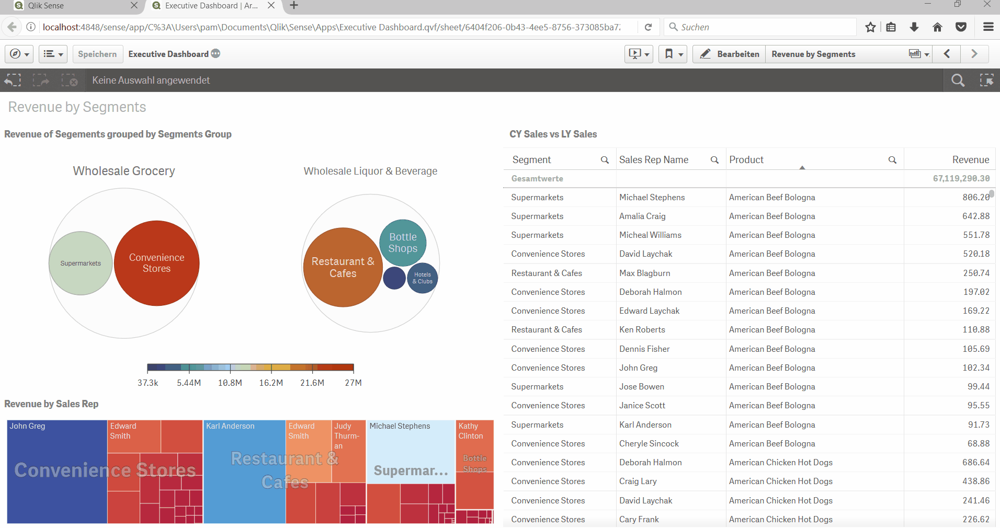

# qlik-bubble-chart

**Qlik Sense Bubble Chart Extension**  
An interactive grouping chart using D3plus, now with dynamic shape selection and custom boundary shapes.

---

## Table of Contents

- [Features](#features)  
- [Demo](#demo)  
- [Installation](#installation)  
- [Usage](#usage)  
- [Configuration](#configuration)  
- [Contributors & Changelog](#contributors--changelog)  
- [Authors](#authors)  
- [License](#license)  

---

## Features

- **Grouping**: Two‐level grouping of items by your primary and secondary dimensions  
- **Size**: Shape size driven by a single measure  
- **Color**: Color by primary dimension, secondary dimension or custom expression  
- **Shapes**: Choose between **Circle**, **Square**, **Diamond**  
- **Legend**: Toggle legend on/off  
- **Loading Message**: Customizable loading text  
- **Min Size**: Control minimum shape size (1–100)  

---

## Demo

  
  

---

## Installation

1. **Fork & Clone**  
   ```bash
   git clone https://github.com/Mehrol911/qlik-bubble-chart

2.  **Zip & Import**
    
    *   Zip the `qlik-bubble-chart` folder (including `.qext`, `src/`, `lib/`, your `icon.png` and `preview.png`).  
    *   In Qlik Sense → QMC → Extensions → **Import**, select your ZIP.  
        
3.  **Add to Sheet**
    
    *   In your app, drag **my-axeed-bubble-chart** onto the canvas.  
        
---

## Usage

1.  **Dimensions**  
    *   **Primary**: Defines the group boundary shape  
    *   **Secondary**: Defines individual items inside each group  
2.  **Measure**  
    *   **Size KPI**: Drives the size of each shape  
3.  **Reload**  
    *   After any change in VS Code, refresh your sheet in Qlik Sense Desktop to see updates immediately.  

---

## Configuration

### Appearance → Options

| Option               | Description                                                                  |
|----------------------|------------------------------------------------------------------------------|
| **Shape Type**       | `Circle` (bubble), `Square`, or `Diamond`                                    |
| **Color by**         | `Primary Dimension`, `Secondary Dimension`, `Expression`, or `None`          |
| **Bubble Min Size**  | Minimum shape size (1–100)                                                   |
| **Show Legend**      | Toggle legend on/off                                                         |
| **Loading Message**  | Custom text shown while data loads                                           |

---

## Contributors & Changelog

**Patric Amatulli** (original author)  
**Mehrol Bazarov** (enhancements: dynamic shape dropdown, diamond boundary, metadata updates)

### v1.1.0
- Added **Shape Type** dropdown (Circle, Square, Diamond)  
- Added **Diamond** boundary shape  
- Updated extension metadata and preview icon  

### v1.0.0
- Initial d3plus bubble grouping extension  

---

## Authors

**Patric Amatulli**  
- LinkedIn: [https://www.linkedin.com/in/patricamatulli/](https://www.linkedin.com/in/patricamatulli/)  
- Company: axeed AG  
- GitHub: [https://github.com/pamaxeed](https://github.com/pamaxeed)  

**Mehrol Bazarov**  
- LinkedIn: [https://www.linkedin.com/in/mehrol911/](https://www.linkedin.com/in/mehrol911/)  
- Company: StrategyCO  
- GitHub: [https://github.com/Mehrol911](https://github.com/Mehrol911)  

---

## License

MIT License  
Copyright © 2017 Patric Amatulli  
Copyright © 2025 Mehrol Bazarov  

Released under the MIT license.  